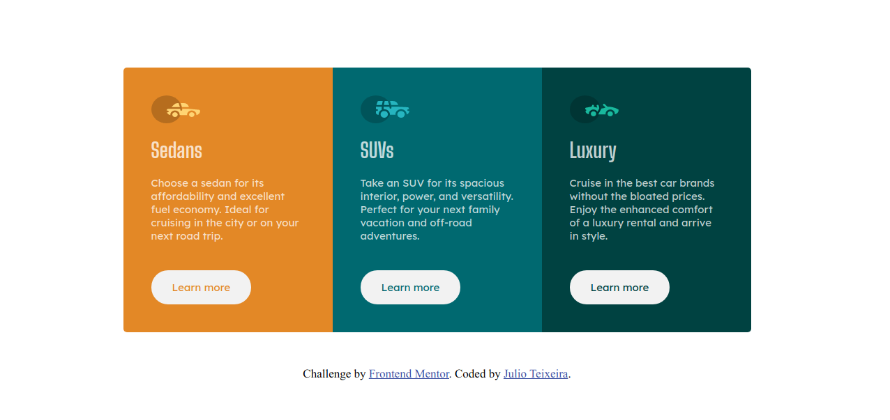

## Table of contents

- [Frontend Mentor - 3-column preview card component](#frontend-mentor---3-column-preview-card-component)
- [Frontend Mentor - 3-column preview card component solution](#frontend-mentor---3-column-preview-card-component-solution)
  - [Overview](#overview)
    - [The challenge](#the-challenge)
    - [Screenshots](#screenshots)
      - [Mobile view](#mobile-view)
      - [Desktop view](#desktop-view)
    - [Links](#links)
  - [My process](#my-process)
    - [Built with](#built-with)
  - [Author](#author)
# Frontend Mentor - 3-column preview card component

# Frontend Mentor - 3-column preview card component solution

This is a solution to the [3-column preview card component challenge on Frontend Mentor](https://www.frontendmentor.io/challenges/3column-preview-card-component-pH92eAR2-). Frontend Mentor challenges help you improve your coding skills by building realistic projects. 

## Overview

### The challenge

Users should be able to:

- View the optimal layout depending on their device's screen size
- See hover states for interactive elements

### Screenshots
#### Mobile view

#### Desktop view

### Links

- Solution URL: [Github solution](https://github.com/jcesarprog/Challenges/tree/main/FrontendMentor/02-3-column-preview-card-component)
- Live Site URL: [Live site](https://jcesarprog.github.io/Challenges/FrontendMentor/02-3-column-preview-card-component/)

## My process
- As soon as i've seen the layouts i thought in terms of CSS Grids and Flexbox.
- Used BEM CSS methodology.
### Built with

- Semantic HTML5 markup
- SASS
- Flexbox
- CSS Grid
- Mobile-first workflow
- BEM

## Author

- Website - [Julio Teixeira](https://www.your-site.com)
- Frontend Mentor - [@jcesarprog](https://www.frontendmentor.io/profile/jcesarprog)
- Twitter - [@jcesarprog](https://www.twitter.com/jcesarprog)
