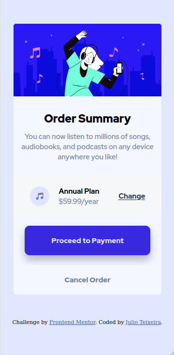
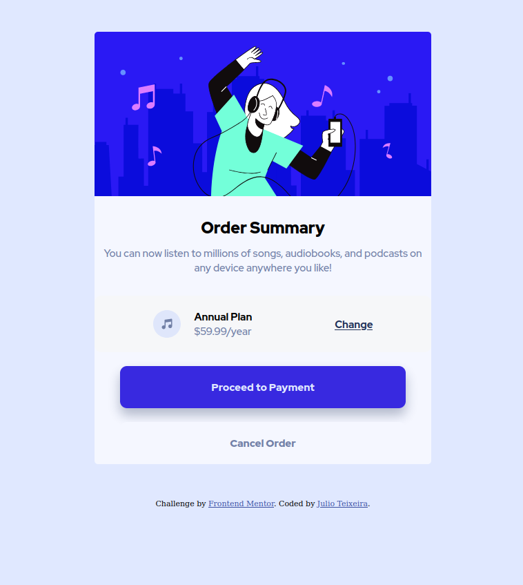

# Frontend Mentor - Order summary card solution

This is a solution to the [Order summary card challenge on Frontend Mentor](https://www.frontendmentor.io/challenges/order-summary-component-QlPmajDUj). Frontend Mentor challenges help you improve your coding skills by building realistic projects. 

## Table of contents

- [Frontend Mentor - Order summary card solution](#frontend-mentor---order-summary-card-solution)
  - [Table of contents](#table-of-contents)
  - [Overview](#overview)
- [Frontend Mentor - Order summary card](#frontend-mentor---order-summary-card)
    - [The challenge](#the-challenge)
    - [Screenshots](#screenshots)
      - [Mobile view](#mobile-view)
      - [Desktop view](#desktop-view)
    - [Links](#links)
  - [My process](#my-process)
    - [Built with](#built-with)
  - [Author](#author)

**Note: Delete this note and update the table of contents based on what sections you keep.**

## Overview
# Frontend Mentor - Order summary card

### The challenge

Users should be able to:

- See hover states for interactive elements

### Screenshots
#### Mobile view

#### Desktop view

### Links

- Solution URL: [Github solution](https://github.com/jcesarprog/Challenges/tree/main/FrontendMentor/03-order-summary-component)
- Live Site URL: [Live site](https://jcesarprog.github.io/Challenges/FrontendMentor/03-order-summary-component/)

## My process
- As soon as i've seen the layouts i've thought in terms of Flexbox.
- Used BEM CSS methodology.
### Built with

- Semantic HTML5 markup
- CSS custom properties
- Flexbox
- Mobile-first workflow
- BEM 

## Author

- Website - [Julio Teixeira](https://www.your-site.com)
- Frontend Mentor - [@jcesarprog](https://www.frontendmentor.io/profile/jcesarprog)
- Twitter - [@jcesarprog](https://www.twitter.com/jcesarprog)
