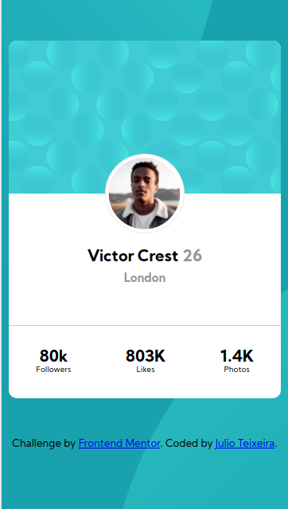
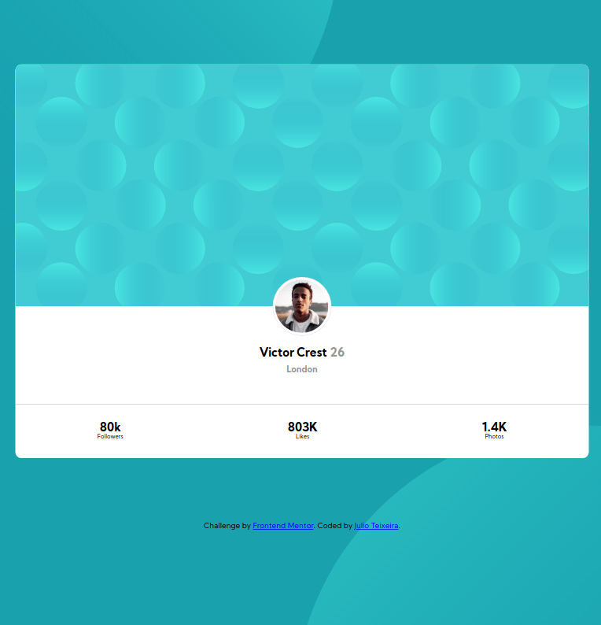

# Frontend Mentor - Profile card component solution

This is a solution to the [Profile card component challenge on Frontend Mentor](https://www.frontendmentor.io/challenges/profile-card-component-cfArpWshJ). Frontend Mentor challenges help you improve your coding skills by building realistic projects. 

## Table of contents

- [Frontend Mentor - Profile card component solution](#frontend-mentor---profile-card-component-solution)
  - [Table of contents](#table-of-contents)
  - [Overview](#overview)
- [Frontend Mentor - Profile card component](#frontend-mentor---profile-card-component)
    - [The challenge](#the-challenge)
    - [Screenshots](#screenshots)
      - [Mobile view](#mobile-view)
      - [Desktop view](#desktop-view)
    - [Links](#links)
  - [My process](#my-process)
    - [Built with](#built-with)
    - [What I learned](#what-i-learned)
  - [Author](#author)

## Overview
# Frontend Mentor - Profile card component

### The challenge

- Build out the project to the designs provided

### Screenshots
#### Mobile view

#### Desktop view

### Links

- Solution URL: [Github solution](https://github.com/jcesarprog/Challenges/tree/main/FrontendMentor/04-profile-card-component)
- Live Site URL: [Live site](https://jcesarprog.github.io/Challenges/FrontendMentor/04-profile-card-component/)

## My process
Created with flexbox since its a unidimensional layout
### Built with

- Semantic HTML5 markup
- SASS
- Flexbox
- Mobile-first workflow
- BEM CSS methodology

### What I learned

Was nice to remember some positioning of background images to get the effect needed

## Author

- Website - [Julio Teixeira](https://jcesarprog.github.io/)
- Frontend Mentor - [@jcesarprog](https://www.frontendmentor.io/profile/jcesarprog)
- Twitter - [@jcesarprog](https://www.twitter.com/jcesarprog)

