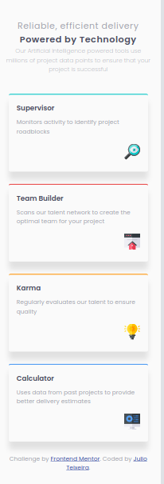
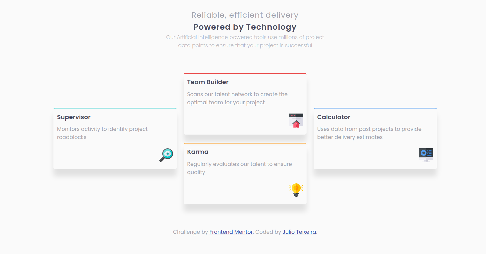

# Frontend Mentor - Four card feature section solution

This is a solution to the [Four card feature section challenge on Frontend Mentor](https://www.frontendmentor.io/challenges/four-card-feature-section-weK1eFYK). Frontend Mentor challenges help you improve your coding skills by building realistic projects. 

## Table of contents

- [Frontend Mentor - Four card feature section solution](#frontend-mentor---four-card-feature-section-solution)
  - [Table of contents](#table-of-contents)
  - [Overview](#overview)
- [Frontend Mentor - Four card feature section](#frontend-mentor---four-card-feature-section)
    - [The challenge](#the-challenge)
    - [Screenshots](#screenshots)
      - [Mobile view](#mobile-view)
      - [Desktop view](#desktop-view)
    - [Links](#links)
  - [My process](#my-process)
    - [Built with](#built-with)
    - [What I learned](#what-i-learned)
  - [Author](#author)

## Overview
# Frontend Mentor - Four card feature section

### The challenge

Users should be able to:

- View the optimal layout for the site depending on their device's screen size

### Screenshots

#### Mobile view

#### Desktop view

### Links

- Solution URL: [Github solution](https://github.com/jcesarprog/Challenges/tree/main/FrontendMentor/06-four-card-feature-section)
- Live Site URL: [Live site](https://jcesarprog.github.io/Challenges/FrontendMentor/06-four-card-feature-section)

## My process
Used flexbox at first then css grid on larger displays
### Built with

- Semantic HTML5 markup
- CSS custom properties
- SASS
- Flexbox
- CSS Grid
- Mobile-first workflow
- BEM

### What I learned
Was nice to recap some cssgrid positioning.

## Author

- Website - [Julio Teixeira](https://jcesarprog.github.io/)
- Frontend Mentor - [@jcesarprog](https://www.frontendmentor.io/profile/jcesarprog)
- Twitter - [@jcesarprog](https://www.twitter.com/jcesarprog)