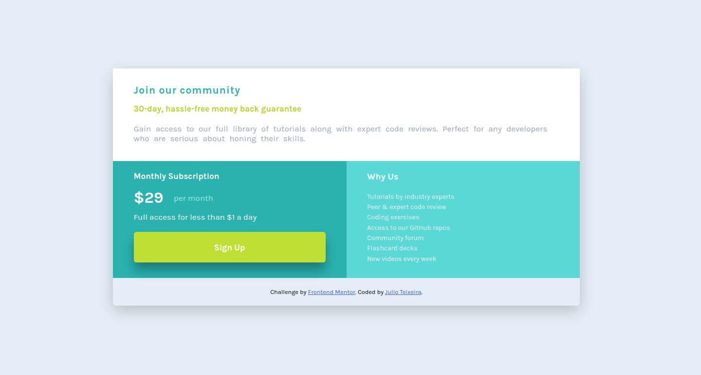

# Frontend Mentor - Single price grid component solution

This is a solution to the [Single price grid component challenge on Frontend Mentor](https://www.frontendmentor.io/challenges/single-price-grid-component-5ce41129d0ff452fec5abbbc). Frontend Mentor challenges help you improve your coding skills by building realistic projects. 

## Table of contents

- [Frontend Mentor - Single price grid component solution](#frontend-mentor---single-price-grid-component-solution)
  - [Table of contents](#table-of-contents)
  - [Overview](#overview)
- [Frontend Mentor - Single price grid component](#frontend-mentor---single-price-grid-component)
    - [The challenge](#the-challenge)
    - [Screenshots](#screenshots)
      - [Mobile view](#mobile-view)
      - [Desktop view](#desktop-view)
    - [Links](#links)
  - [My process](#my-process)
    - [Built with](#built-with)
    - [What I learned](#what-i-learned)
  - [Author](#author)

## Overview

# Frontend Mentor - Single price grid component

### The challenge

Users should be able to:

- View the optimal layout for the component depending on their device's screen size
- See a hover state on desktop for the Sign Up call-to-action

### Screenshots

#### Mobile view

#### Desktop view

### Links

- Solution URL: [Github solution](https://github.com/jcesarprog/Challenges/tree/main/FrontendMentor/07-single-price-grid-component)
- Live Site URL: [Live site](https://jcesarprog.github.io/Challenges/FrontendMentor/07-single-price-grid-component)

## My process
Used Css grid just for larger layouts, and flexbox on pontual stuff
### Built with

- Semantic HTML5 markup
- CSS custom properties
- SASS
- SASS Builtin Modules
- SASS new @use @forward
- Flexbox
- CSS Grid
- BEM CSS Methodology
- Mobile-first workflow

### What I learned
Used thos project to pratice how to use SASS without the @import keyword, since it's being soon depreciated and to learn some other sass built in modules

## Author

- Website - [Julio Teixeira](https://jcesarprog.github.io/)
- Frontend Mentor - [@jcesarprog](https://www.frontendmentor.io/profile/jcesarprog)
- Twitter - [@jcesarprog](https://www.twitter.com/jcesarprog)
