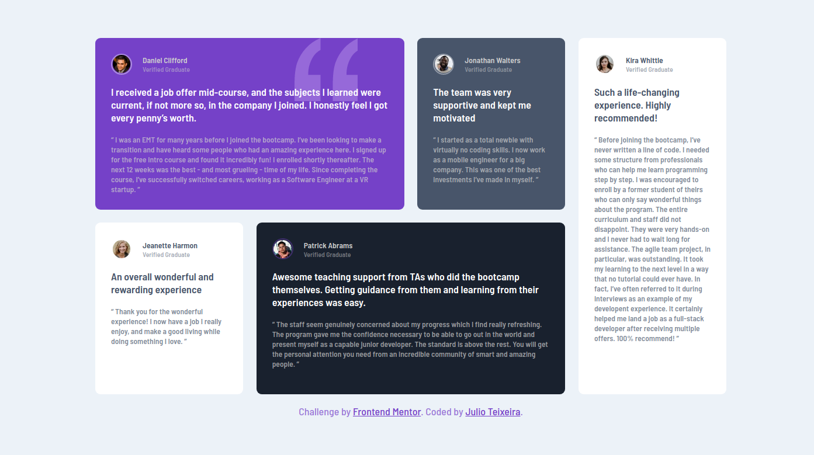

# Frontend Mentor - Testimonials grid section solution

This is a solution to the [Testimonials grid section challenge on Frontend Mentor](https://www.frontendmentor.io/challenges/testimonials-grid-section-Nnw6J7Un7). Frontend Mentor challenges help you improve your coding skills by building realistic projects. 

## Table of contents

- [Frontend Mentor - Testimonials grid section solution](#frontend-mentor---testimonials-grid-section-solution)
  - [Table of contents](#table-of-contents)
  - [Overview](#overview)
- [Frontend Mentor - Testimonials grid section](#frontend-mentor---testimonials-grid-section)
    - [The challenge](#the-challenge)
    - [Screenshots](#screenshots)
      - [Mobile view](#mobile-view)
      - [Desktop view](#desktop-view)
    - [Links](#links)
  - [My process](#my-process)
    - [Built with](#built-with)
    - [What I learned](#what-i-learned)
  - [Author](#author)

## Overview
# Frontend Mentor - Testimonials grid section

### The challenge

Users should be able to:

- View the optimal layout for the site depending on their device's screen size

### Screenshots
#### Mobile view

#### Desktop view

### Links

- Solution URL: [Github solution](https://github.com/jcesarprog/Challenges/tree/main/FrontendMentor/09-testimonials-grid-section)
- Live Site URL: [Live site](https://jcesarprog.github.io/Challenges/FrontendMentor/09-testimonials-grid-section/)

## My process
Created with Responsive CSS Grid, Flexbox and Modern SASS.

### Built with

- Semantic HTML5 markup
- CSS custom properties
- Flexbox
- CSS Grid
- Modern SASS
- Mobile-first workflow
- BEM CSS methodology

### What I learned

Was great to practice css grid with custom layouts!

## Author

- Website - [Julio Teixeira](https://jcesarprog.github.io/)
- Frontend Mentor - [@jcesarprog](https://www.frontendmentor.io/profile/jcesarprog)
- Twitter - [@jcesarprog](https://www.twitter.com/jcesarprog)